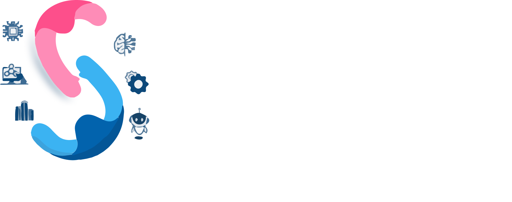

<h1 align="center">  <b>🔥 SAMBHAV - DYPCOE 🔥</b></h1>

<!-- 

 -->
<!-- PROJECT LOGO -->
 

  

## About Us 🚀

Sambhav is a technical festival offering a diverse range of events and competitions focused on technology and innovation. 
It provides a platform for individuals to showcase their skills, learn from others, and foster creativity, teamwork, 
and problem-solving abilities. By exposing attendees to the latest advancements in technology, Sambhav helps broaden 
their knowledge and skillset, making it a fun, engaging, and enriching experience for all attendees. Get ready to be 
a part of the biggest technical extravaganza of the year 2k23 – Sambhav!

 
Events:

SAMBHAV reflects the spirit of the festival and its mission to provide a platform for individuals to push their limits and challenge themselves to turn their ideas and innovative projects into reality. The festival offers a diverse range of technical events and competitions designed to showcase the talents and skills of participants while fostering creativity, teamwork, and problem-solving abilities. With its focus on technology and innovation, Sambhav truly embodies its name and serves as a catalyst for making the impossible possible.

## Tech Stack 🗃

### Frontend :

   
 <!-- 
  -->
 
 ### Backend :
 
 
 
 
 
## Glimpse ✨

### Website : [Click here](https://sambhav-dypcoe.netlify.app/)
</a>
